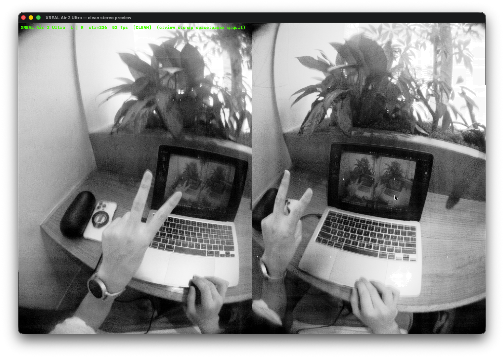

# XREAL Air 2 Ultra — macOS用ステレオカメラビューア

**XREAL Air 2 Ultra のステレオトラッキングカメラを macOS で読み取る — SDK不要、kext不要、ドライバ不要。**

[English README is here](README.md)

Air 2 Ultra はトラッキングカメラを標準の UVC (USB Video Class) デバイスとして公開して
いますが、映像ストリームは**ブロック単位でスクランブル**されており、通常のWebカメラ
ビューアではノイズにしか見えません。本プロジェクトはこれをリアルタイムでデスクランブルし、
クリーンな 640×480 ステレオグレースケール映像を取得します — VIO/SLAM実験、ロボティクス、
ハードウェア解析などの入力にそのまま使えます。



## クイックスタート

必要なもの: Xcode Command Line Tools (`xcode-select --install`) の入ったMac、
USB-C接続した Air 2 Ultra。

```sh
make
./preview_clean
```

これだけです。初回実行時にターミナルへのカメラ権限を求められます。
左右カメラのライブ映像(デスクランブル+ノイズ除去済み)のウィンドウが開きます。

キー操作: `c` クリーン/スクランブル表示切替 · `s` スナップショットPNG保存 · `space` 一時停止 · `q` 終了

## ツール一覧

| ツール | 機能 |
|--------|------|
| `preview_clean` | リアルタイムステレオビューア(デスクランブル+固定パターンノイズ除去)、60fps。`--snap out.png` でウィンドウなしスナップショット、`--test in.pgm prefix` でオフライン検証。 |
| `xreal_cam` | レコーダー: `./xreal_cam <フレーム数> <出力dir>` で生の `cam0_*.pgm` / `cam1_*.pgm`(スクランブルされたまま)と `meta.csv` を保存。 |
| `enumerate` | AVFoundationのカメラ一覧とXREALデバイスのフォーマットを表示。 |
| `python/process_clean.py` | オフラインパイプライン: `python3 python/process_clean.py <キャプチャdir> <出力dir>` で録画をデスクランブル+クリーン化してPNGと左右並置の `stereo_feed.mp4` を生成。要 `numpy opencv-python pillow`。 |
| `python/xreal_descramble.py` | 単一フレーム用の最小デスクランブラ。リファレンス実装。 |
| `research/` | リバースエンジニアリング用ツール群(ベンダーHIDコマンド、UVCコントロール、USBディスクリプタ)。[research/README.md](research/README.md) 参照。 |

## 仕組み(概要)

- グラスは通常のUVC Webカメラとして列挙されます(`640×482 @ 60fps`、名目上YUVですが
  実際は**1バイト=1モノクロ画素**)。0〜479行目が画像、480行目がテレメトリ、481行目がパディング。
- 各フレームの画像307,200バイトは**128ブロック×2,400バイト**の固定順列でシャッフルされ、
  開始位相がフレーム毎に回転します。魚眼レンズの黒い縁で始まるブロックを探すことで同期を回復します。
- 連続するUVCフレームは左右カメラを交互に運びますが、**順序は固定ではありません** —
  テレメトリ行の58バイト目(`0x20`/`0x21`)がどちらのカメラかを示します。
- センサーは90°回転(かつ左右で互いに180°逆向き)に実装されているため、デスクランブラは
  回転も行います。出力は片眼あたり480×640の縦向きです。
- 残る縦縞(列固定パターンノイズ)はオンラインで推定して減算します。

プロトコルの詳細(USBレイアウト、テレメトリ行のマップ、スクランブルアルゴリズム、
UVC露出コントロール、ベンダーHIDプロトコル): **[docs/PROTOCOL.md](docs/PROTOCOL.md)**

## クレジット

- ブロック並べ替え表は [mazeasdamien/myXreal](https://github.com/mazeasdamien/myXreal)
  (`stereo_camera.cpp`)の解析成果です。
- ベンダーHIDパケットフォーマットは
  [badicsalex/ar-drivers-rs](https://github.com/badicsalex/ar-drivers-rs) に文書化されています。
- 本リポジトリの解析・ツール・ドキュメントは [Claude Code](https://claude.com/claude-code)
  (Claude Fable 5) との協働で開発されました。

## 免責事項

本プロジェクトは非公式のリバースエンジニアリング成果であり、XREALとは無関係です。
標準UVC経由でカメラストリームを*読み取るだけ*で、デバイスを変更するコマンドは送信しませんが、
使用は自己責任でお願いします。

## ライセンス

[MIT](LICENSE)
